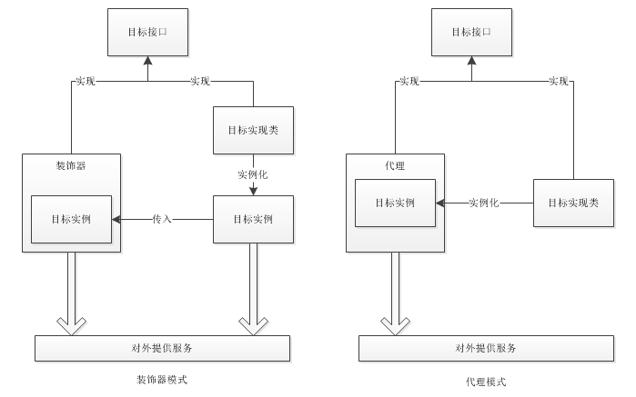

# 装饰器模式
装饰器模式（Decorator Pattern）允许向一个现有的对象添加新的功能，
同时又不改变其结构。这种类型的设计模式属于结构型模式，它是作为现有的类的一个包装。

这种模式创建了一个装饰类，用来包装原有的类，
并在保持类方法签名完整性的前提下，提供了额外的功能。


## 介绍
意图：动态地给一个对象添加一些额外的职责。
就增加功能来说，装饰器模式相比生成子类更为灵活。

主要解决：一般的，我们为了扩展一个类经常使用继承方式实现，
由于继承为类引入静态特征，并且随着扩展功能的增多，子类会很膨胀。

何时使用：在不想增加很多子类的情况下扩展类。

如何解决：将具体功能职责划分，同时继承装饰者模式。

关键代码： 

1、Component 类充当抽象角色，不应该具体实现。 

2、修饰类引用和继承 Component 类，具体扩展类重写父类方法。

应用实例： 

1、孙悟空有 72 变，当他变成"庙宇"后，他的根本还是一只猴子，但是他又有了庙宇的功能。 

2、不论一幅画有没有画框都可以挂在墙上，但是通常都是有画框的，并且实际上是画框被挂在墙上。在挂在墙上之前，画可以被蒙上玻璃，装到框子里；这时画、玻璃和画框形成了一个物体。

优点：装饰类和被装饰类可以独立发展，不会相互耦合，装饰模式是继承的一个替代模式，
装饰模式可以动态扩展一个实现类的功能。

缺点：多层装饰比较复杂。

使用场景： 

1、扩展一个类的功能。 

2、动态增加功能，动态撤销。

注意事项：可代替继承。 


装饰器模式作用是针对目标方法进行增强，提供新的功能或者额外的功能。

不同于适配器模式和桥接模式，装饰器模式涉及的是单方，和代理模式相同，而且目标必须是抽象的。

而实际上，装饰器模式和代理模式的实现方式基本一致，只在目标的存在上有些差别，这个后面我们具体讲述。

上面我们说过装饰器模式与代理模式基本相同，只存在少许差别。

我们需要从概念上了解代理和装饰的区别：

代理是全权代理，目标根本不对外，全部由代理类来完成。
装饰是增强，是辅助，目标仍然可以自行对外提供服务，装饰器只起增强作用。
上面两点提现到代码实现中是这样的：
代理模式

```java
public class Proxy implements House {
    private House house;
    public Decorator(){
        this.house = new DonghaoHouse();
    }
    @Override
    public void output() {
        System.out.println("这是针对目标的前段增强");
        house.output();
        System.out.println("这是针对目标的后段增强");
    }
}
```

装饰模式
```java
public class Decorator implements House {
    private House house;
    public Decorator(House house){
        this.house = house;
    }
    @Override
    public void output() {
        System.out.println("这是针对房子的前段装饰增强");
        house.output();
        System.out.println("这是针对房子的后段装饰增强");
    }
}
```

看出来了吗，装饰器中持有的目标实例是从构造器传入的，
而代理中持有的目标实例是自己创建的。

那么这里又出现一个区别，代理模式和装饰器模式虽然都依赖于目标接口，
但是代理针对的目标实现类是固定的，
而装饰器模式可以随意指定，也就是说目标是可以自有扩展的。

我们要明白代理模式和装饰器模式的区别，区分二者的使用场景，如下图：




## 装饰模式的应用场景
前面讲解了关于装饰模式的结构与特点，下面介绍其适用的应用场景，装饰模式通常在以下几种情况使用。
当需要给一个现有类添加附加职责，而又不能采用生成子类的方法进行扩充时。例如，该类被隐藏或者该类是终极类或者采用继承方式会产生大量的子类。
当需要通过对现有的一组基本功能进行排列组合而产生非常多的功能时，采用继承关系很难实现，而采用装饰模式却很好实现。
当对象的功能要求可以动态地添加，也可以再动态地撤销时。

装饰模式在 Java 语言中的最著名的应用莫过于 Java I/O 标准库的设计了。例如，InputStream 的子类 FilterInputStream，OutputStream 的子类 FilterOutputStream，Reader 的子类 BufferedReader 以及 FilterReader，还有 Writer 的子类 BufferedWriter、FilterWriter 以及 PrintWriter 等，它们都是抽象装饰类。

下面代码是为 FileReader 增加缓冲区而采用的装饰类 BufferedReader 的例子：

```java
BufferedReader in=new BufferedReader(new FileReader("filename.txtn));
String s=in.readLine()
```